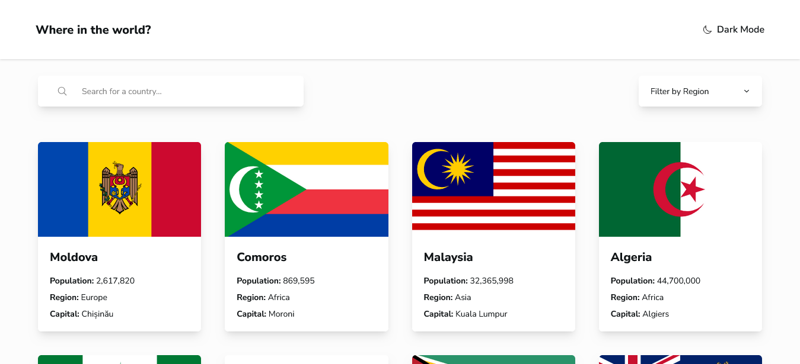
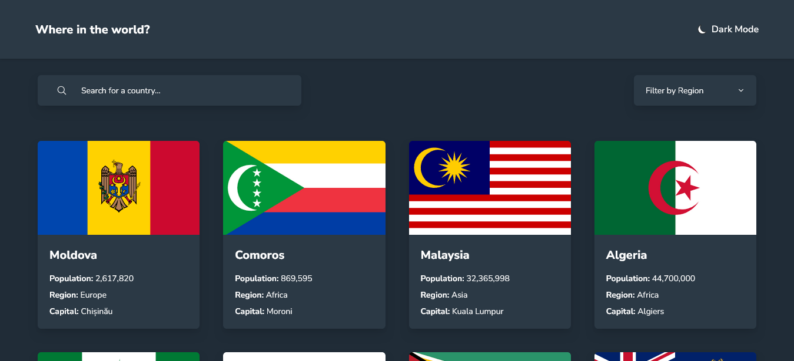
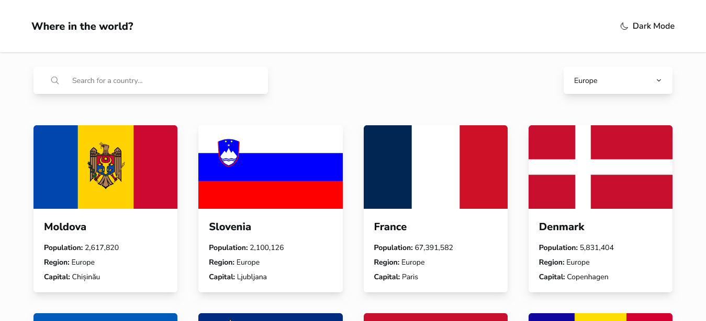
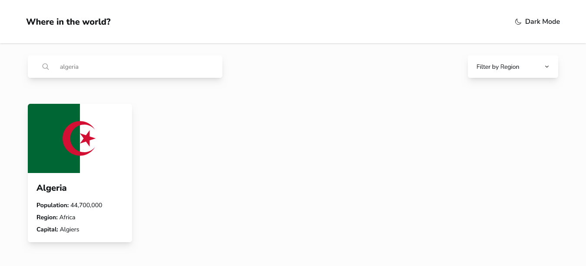
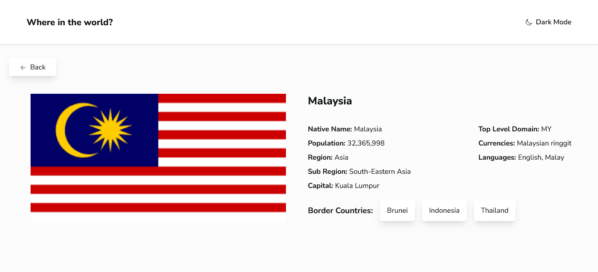

# Frontend Mentor - REST Countries API with color theme switcher solution

## Table of contents

- [Overview](#overview)
  - [The challenge](#the-challenge)
  - [Screenshot](#screenshot)
  - [Links](#links)
- [My process](#my-process)
  - [Built with](#built-with)
  - [What I learned](#what-i-learned)

## Overview

### The challenge

Users should be able to:

- See all countries from the API on the homepage
- Search for a country using an `input` field
- Filter countries by region
- Click on a country to see more detailed information on a separate page
- Click through to the border countries on the detail page
- Toggle the color scheme between light and dark mode 

### Screenshot

### Links

- Solution : [solution URL here](https://cassiopeia001.github.io/rest-countries-api/)
- Live Site : [live site URL here](https://github.com/cassiopeia001/rest-countries-api)

## My process

### Built with

- Semantic HTML5 markup
- Flexbox
- CSS Grid
- Mobile-first workflow
- Accessibility 
- Responsive Design
- [React](https://reactjs.org/) - JS library
- [React-Router](https://reactrouter.com/) - A multi-strategy router for React
- [Rest-countries-API](https://restcountries.com/) - a RESTful API that provides information about countries
- [Tailwind](https://tailwindcss.com/) - A utility-first CSS framework
- [Motion](https://motion.dev/docs/react) - React animation library

### What I learned

During the development of this project, I gained valuable experience, particularly how to work with react router which enabled me to create a single-page application (SPA) with a more fluid and interactive user experience. I also integrated a RESTful API to fetch and display country data. This presented a challenge later on when the API provider restricted the number of countries returned per request. However, I was able to overcome this by requesting only the necessary fields. Additionally, I implemented dark mode functionality for the first time, enhancing the user experience and accessibility.